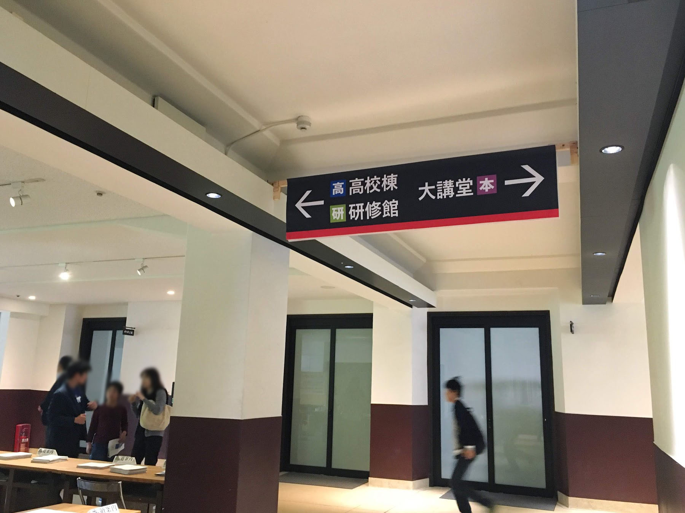
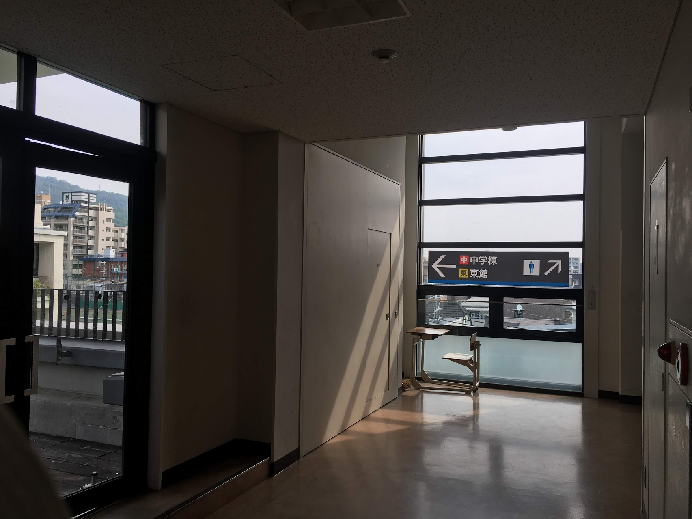
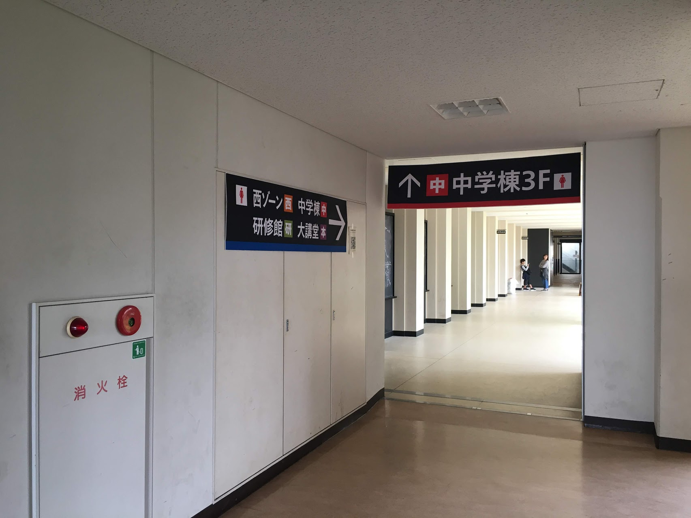
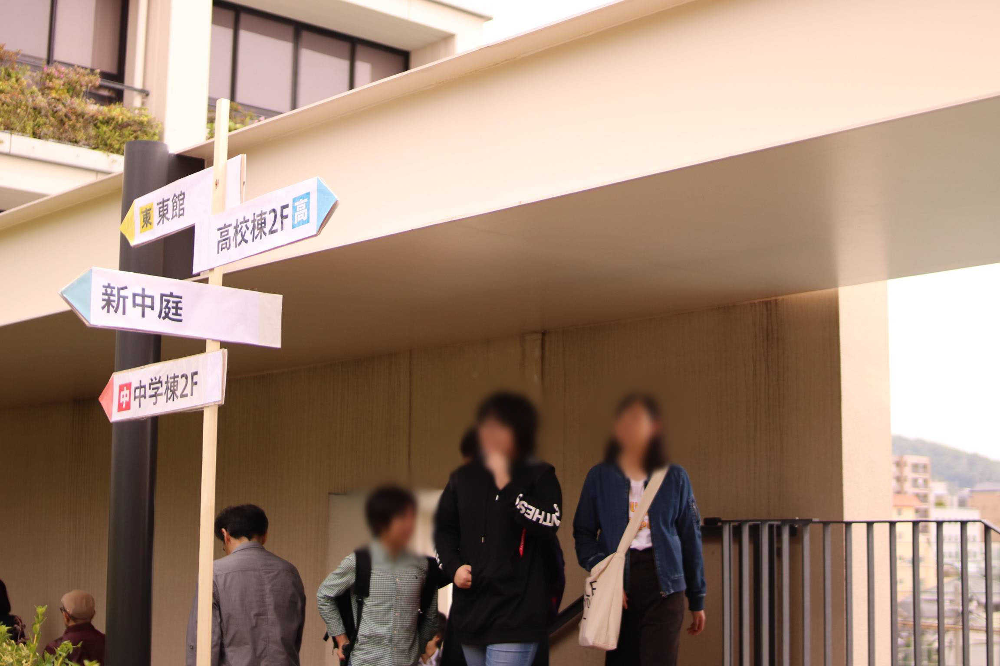
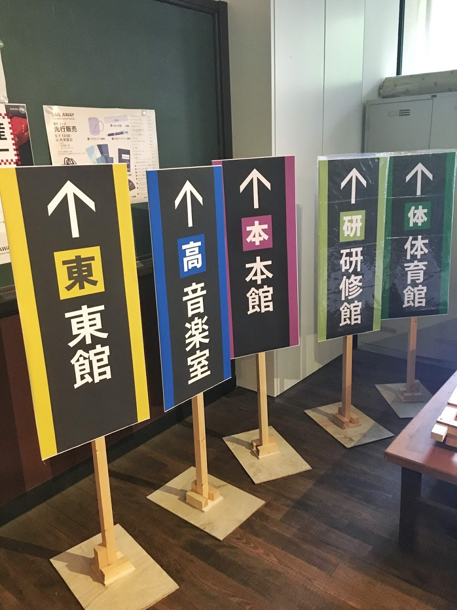
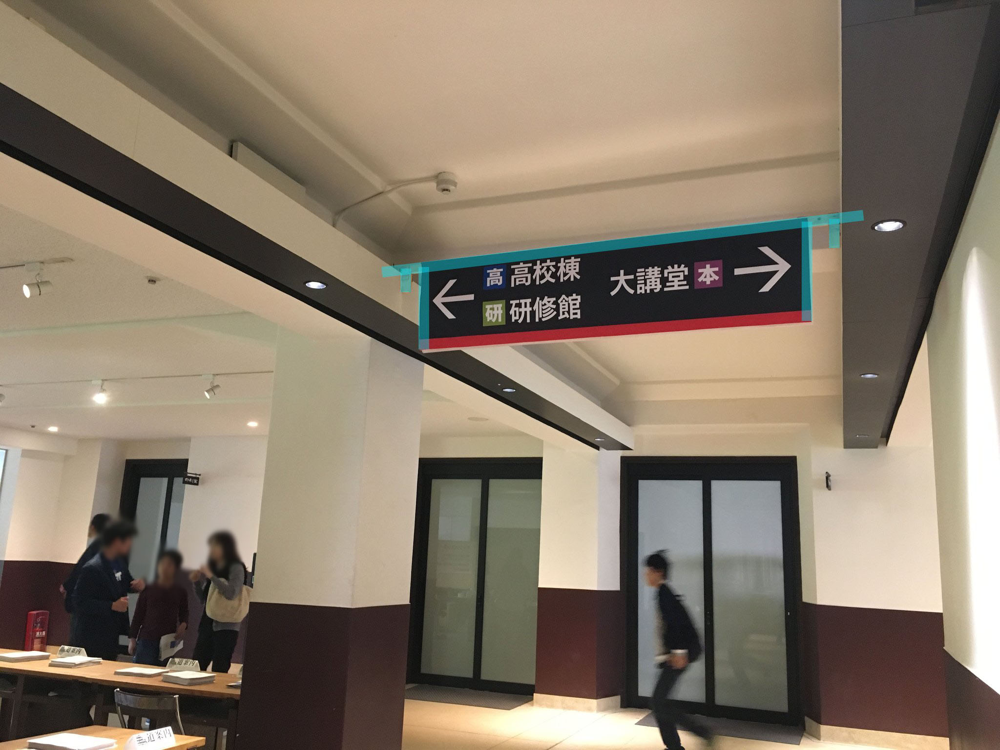
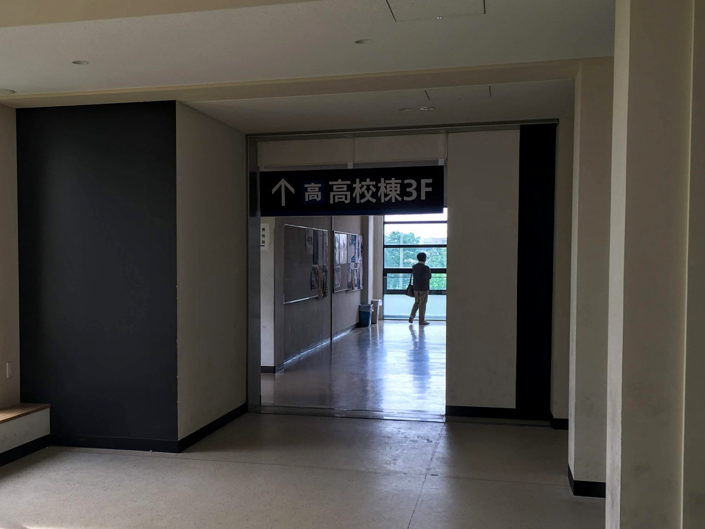

# サイン

案内掲示について記述する。

## 分類

### 廊下

中学棟・高校棟・西ゾーンの廊下の天井に吊るすようにして設置しているもの。案内掲示として最も複雑かつ数が多いため、制作設営共に手数が多い。

### 方向看板

横長のサインを木製のポールに取り付け、付近のエリアへの方向を直感的に読み取れるようにしたもの。

### 立て看板

体育館・東館などメインエリアから離れて単独で存在しているエリアなどについて、入り口でエリア名(建物名)を示すもの。

### フロアマップ

各フロアのサークル一覧や配置マップなどを示すもの。各階の階段付近に掲示する。

基本的にパンフレットのサークルページのマップを流用すれば良い。

## デザイン

視認性に考慮し書体や色使いを検討し制作する。

2018/19年に使用したデザインシステムのガイドラインは [SignSystem.pdf](./SignSystem.pdf) を参照。

2019年のデザインファイル(.ai)は [aiフォルダ](./ai) に置いている。基本的に全てたづがね角ゴシックを使用しており、インストールされていない環境では表示できないが、`text-ol`レイヤーにアウトライン化したものも用意している。テキストだけ使用して書体は変えたいという場合は`text`レイヤーを活用してほしい。

なお、実際に印刷用に使用したPDFファイルも [distフォルダ](./dist) に用意しているため、何も変更する必要がないという場合にはこちらを利用すれば良い。

## 印刷

PC教室の大判印刷機を利用し非光沢紙に印刷する。数も多く規模が大きいため、事前にPC教室教員に相談したほうが良い。

文化祭1,2週間前に印刷するファイルを送り、準備期間に入るまでに印刷が完了しているのが望ましい。大判印刷機は印刷に時間がかかり、前述の通り数も多いためすぐに印刷できるものではないことに留意する。

## 設営

設営は基本的に全て準備期間で行う。ポスター掲示同様脚立が必要な作業があるため、ポスター掲示や脚立を使用するサークルとの兼ね合いを考える必要がある。[ポスターの掲示についての記述](../poster/README.md#掲示)も参照。

木製パーツを利用したものが多いため、立体装飾班との連携が必要。なおこれらの木製パーツは中学棟1階の食堂付近倉庫(セラー?)や立体装飾班作業場所(長屋内スペース)に保管されている。

### 廊下

印刷したものをプラダンボールに貼り付けた上で設置する。プラダンボールは例年ロイヤルホームセンター東灘魚崎店で購入しており、サイズは1840x900mmのものを2分割し、1840x450mmをサイン1つ分として利用している。買い出しの際後述の両面テープや結束バンドも購入する。

中学棟は以下の画像の水色部分で示されたコの字のような形の木の枠を利用する。

木枠の両側にプラダンボールを貼り付け、木枠を廊下上部のせり出している部分(カバーと呼称)に渡した上で、木枠端が左右にズレて落下するのを防ぐためにカバー内の金属部品(一定間隔で存在)と木枠の端を結束バンドで固定する。

高校棟と西ゾーンについては、壁に直接固定できる箇所はそのまま両面テープで設置し、他はプラダンボールの切れ端を利用して固定用のパーツを作って設置する。

|直接固定|固定パーツ使用|
|---|---|
|||

固定パーツはプラダンボールを適当な長さで50mm幅に切ったもの。これをサイン本体のプラダンボールに左右と中央の計3本両面テープで取り付け、固定パーツの先を両面テープで天井などに固定する。

校舎の壁紙を傷つけないよう、両面テープでの固定は全て金属やプラスチック、窓ガラスといった材質の箇所を選ぶ。高校棟及び西ゾーンのサインはこの制約により設置場所が限られる。

特に固定パーツを使用する箇所において、3点の両面テープだけで支持するためにかなりの負荷がかかるため、平滑面用の特殊な両面テープ(商品名は「3Mスコッチ超強力両面テーププレミアゴールドスーパー多用途 平滑面用」)を用いる。案内掲示を始めた年から落下が頻発する中でなんとか編み出された対処法のため、これは基本的に変えず踏襲してほしい。

### 方向看板

横長の木製パーツに印刷されたサインを貼り付け、スタンドへの取り付けは立体装飾班に依頼する。風にも弱く安定性に不安が残るため、文化祭当日も含め状態に注意する。

### 立て看板

印刷されたものを木製スタンドに貼り付け、簡易的な防水加工として上から透明のビニール袋をかける。以下の画像では右2枚が防水加工後のもの。

### フロアマップ

ポスターと同様掲示板に画鋲で設置する。
